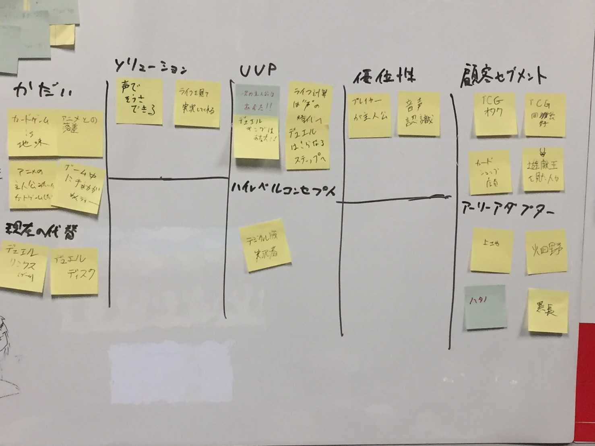

## チーム名
イマギレ7

## Board Game Master
東京工芸大学のenPiT2019制作物のB.G.Mです。

## サービス名
## 「黒服のイソノ」

エレベーターピッチ
臨場感を持ってカードゲームしたいカードゲーマー向けの
「黒服のイソノ」はデジタル実況者です。
これは、ゲームのプレイを盛り上げることができ。
デジタルリンクス（ゲーム）と異なり、音声認識が備わっていることが強みです。

## プロダクトバックログ

~~[Trello](https://trello.com/b/7lEj4F9z/enpit2019) ~~
[Projects](https://github.com/imagirelab/enPiT2019_t-kougei/projects/1)へ

## ワーキングアグリーメント

朝練に遅刻したら朝「マック」を全員におごり 
夕方のコアタイムに遅刻したら「マック」おごり 
欠席した場合「焼肉おごり」 
（上記は嘉悦大のものです）

## メンバー

**プロダクトオーナー** : 畑野 智洋 
**スクラムマスター**　 : 上地 悠悟 
**開発メンバー**　　　 : 伊藤 克真, 門馬 雄一, 黒長 功稀 

## コアタイム

火曜日  9:00 〜 11:00 
火曜日 18:30 〜 22:00 

## 開発環境

[Python 3](https://www.python.org/) 
[Flask](https://a2c.bitbucket.io/flask/) 
（上記は嘉悦大のものです）

## 実行ページ
[heroku](https://bonbeewalker.herokuapp.com/)
（上記は嘉悦大のものです）

# リーンキャンバス

# デモのフィードバック
##  10/16
- 誰が声をあてるのか？ 
　メンバーの誰か
- 前回のプロダクトはなぜ消えたのか？
　未来がないのでやめました。

